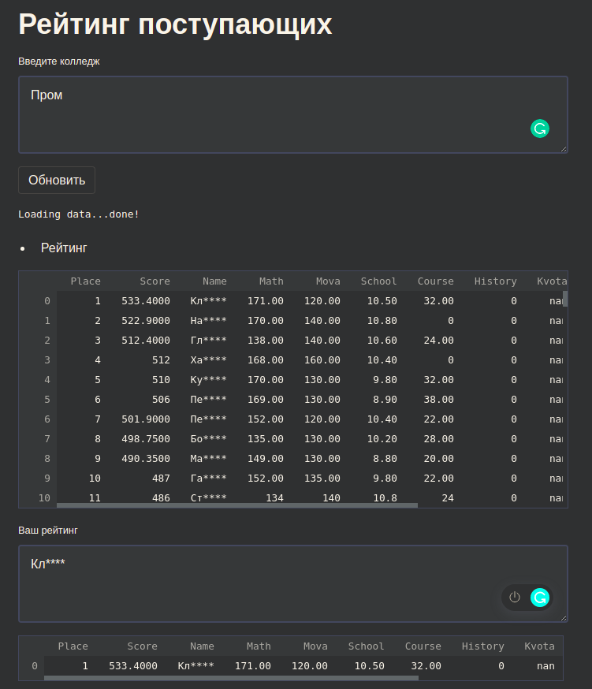

Получение рейтинга поступающего для оценки своих шансов. Интерфес реализован используя streamlit. Рейтинги обновляютсья используя источник - вступ освита. Также реализирована возможность вывода гитаграмм по составляющим конкурсного балла.
 

Для коректного функционирования программы нужно:
- установить зависимости -> pip install - r requirements.txt;
- указать в словаре URL_dict ключем найменнование учебного заведение, значением - ссылку УЗ с сайта источника рейтинга.

Для запуска использовать команду -> streamlit run app.py 

